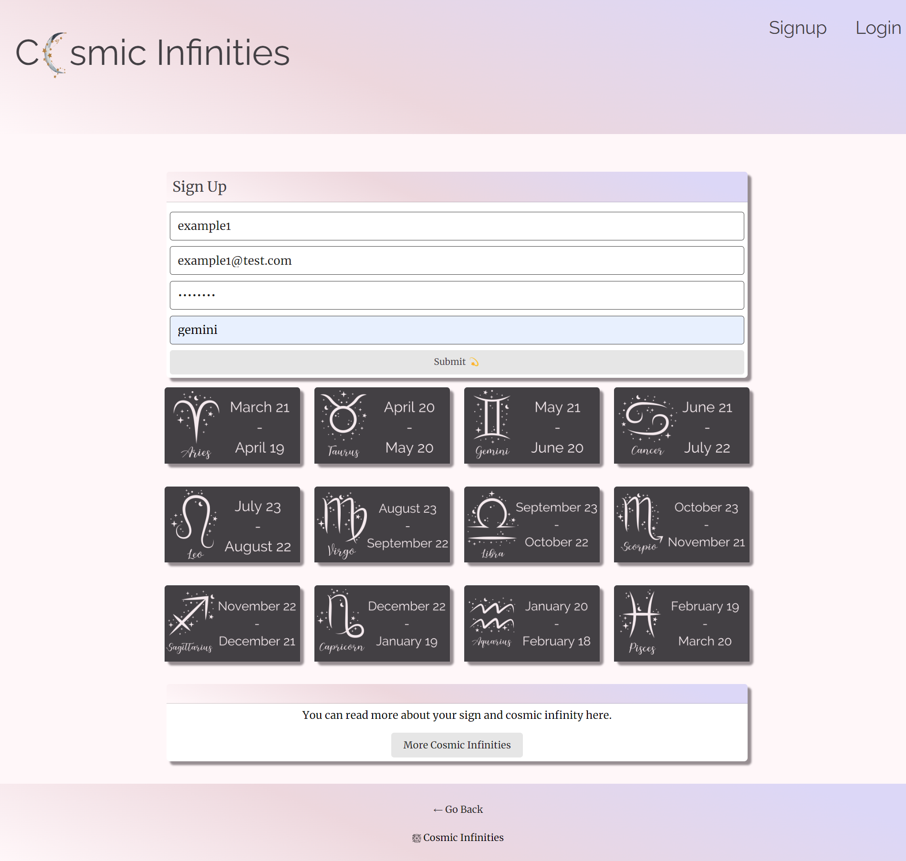
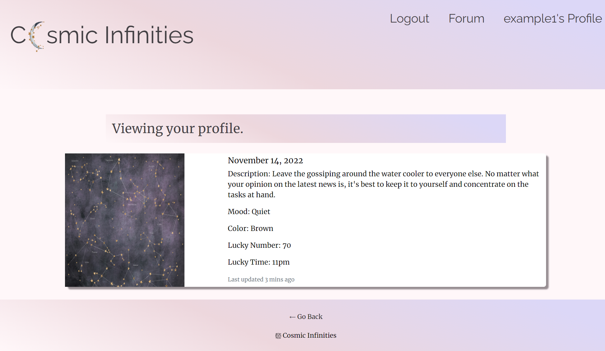

# **Cosmic Infinities**

---

|Table of Contents                              |
|-----------------------------------------------|
|[Screenshot-Usage](#screenshot-usage)          |
|[Live Link](#live-link)                        |
|[Installation](#installation)                  |
|[Description](#description)                    |
|[Built With](#built-with)                      |
|[Continued Development](#continued-development)|
|[Contributors](#contributors)                  |
|[LightHouse Report](#lighthouse-report)        |
|[License](#license)                            |

---

## **Screenshot-Usage**
Landing Page

Click signup button to register. Enter username, email, password, sign.

 

If already registered click log-In button and enter email address and password to verify your identity.

Enter your thoughts to share with community or comment on User’s thought.

Click Profile button to view your daily horoscope, mood, color, lucky number and lucky time for the day.

---

## **Live Link**
[Cosmic Infinities](https://secure-anchorage-76382.herokuapp.com/)

---

## **Installation**
User will be able to visit website live thru Heroku. If User wants to download code:
|Terminal       |
|---------------|
|npm i          |
|npm run seed   |
|npm run develop|

---

## **Description**
The Cosmic Infinities app is a built-from-scratch React App. Application was developed for people who are interested in horoscopes and would like to share their thoughts and have discussions with people who have the same interests.
Cosmic Infinities app is a fun way to start the day, generating random quotes to take user’s mind off of the day-to-day problems, and providing daily horoscope which includes mood, color, lucky number and lucky time.

---
## **Built With**
|            |
|------------| 
|ReactJs     |
|MongoDB     |
|Mongoose ODM|
|Express.js  |
|Node.js     |
|GraphQL API |
|Heroku      |

---

## **Continued Development**
-Provide user with weekly, monthly and yearly horoscope (using third-party API)

 

-Populating database of people who are able to read fortune, providing them with the ability to advertise on our website and schedule calls/meeting (integrating the Stripe payment platform)

 

-Populating different types horoscopes 

---

## **Contributors**
|Visit our GitHub:                                   | 
|-----------------------------------------------     |
|[Yasmin Bustamani](https://github.com/yazbustami)   |
|[Tatiana Collins](https://github.com/T8886)         |
|[Jessica Morse](https://github.com/jessicamorse23)  |
|[Anna Kowalczyk](https://github.com/akowala)        |
|[Marianella Gamboa](https://github.com/Marianellag1)|

---

## **LightHouse Report**

---

### **License**
This project is licensed under:
    MIT
